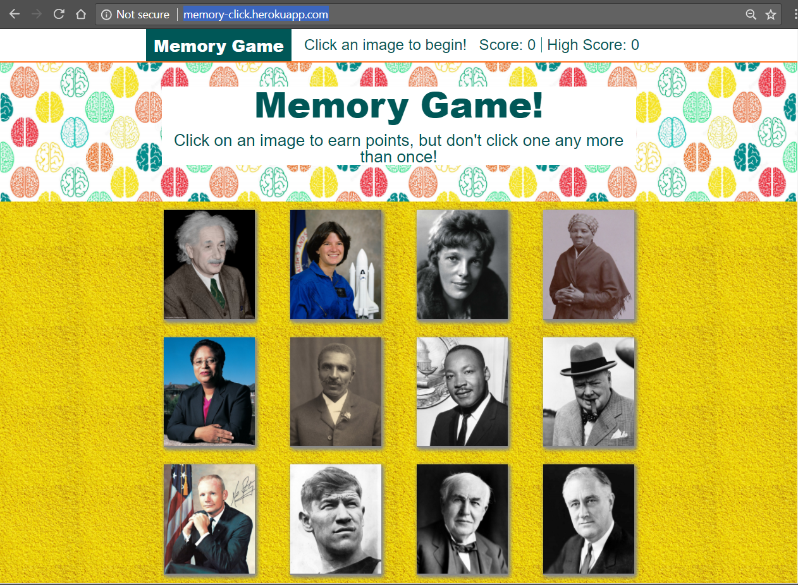

# React Memory Game

### Overview

This application uses React to build a simple application where the user clicks on pictures to get points. The game ends if the user clicks the same picture twice or the user clicks all the pictures without duplicates.

### Instructions

1. The application is located as follows:

   * Heroku deployment: [Memory Game](https://memory-click.herokuapp.com/)

   * GitHub repository: [Memory Game GitHub Repository](https://github.com/bpzimmerman/memory)

2. Simply click a picture to start the game.

3. Every picture clicked without duplicates will advance the score.

4. The highscore will advance if the score exceeds the current highscore.

5. The game will end (and the score will reset) if a picture is clicked twice or if all the pictures are clicked without duplicates.